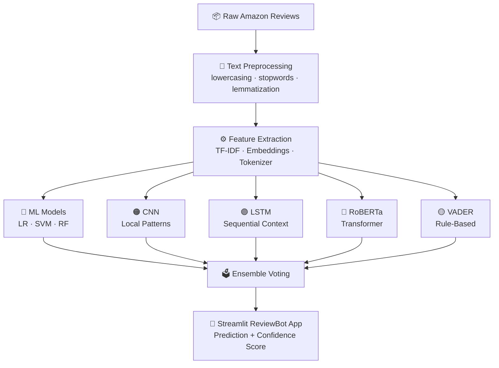
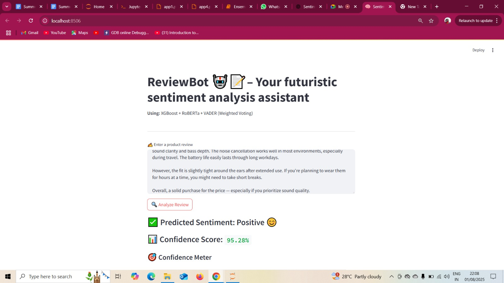

# ⭐ Amazon Review Sentiment Analysis — Multi-Model NLP System

<p align="center">
  
  
  
  
  
</p>

> **A production-grade NLP pipeline that classifies Amazon product reviews as Positive / Negative / Neutral using 5 different models — from classical ML to transformer-based deep learning.**

---

## ❓ Problem Statement

Amazon has **over 1.5 billion product reviews** — and businesses have no scalable way to:

- Understand what customers actually feel about their products
- Detect negative sentiment trends *before* they damage brand reputation
- Compare performance across different ML approaches (ML vs DL vs Transformers)

Manual reading is impossible. Basic keyword tools miss context. This project builds a **full multi-model NLP system** that reads reviews the way humans do.

---

## 💥 Impact & Key Numbers

<table>
  <tr>
    <td align="center"><b>5 Models</b><br/>Trained & Compared</td>
    <td align="center"><b>3 Approaches</b><br/>Classical ML · Deep Learning · Transformers</td>
    <td align="center"><b>1 Live App</b><br/>Streamlit ReviewBot deployed</td>
  </tr>
  <tr>
    <td align="center"><b>RoBERTa</b><br/>Highest accuracy model</td>
    <td align="center"><b>Ensemble</b><br/>Final voting model for best predictions</td>
    <td align="center"><b>3 Classes</b><br/>Positive · Negative · Neutral</td>
  </tr>
</table>

---

## 🧠 Models Built & Compared

| Model | Type | Strength |
|---|---|---|
| Logistic Regression / SVM / RF | Classical ML | Fast baseline, interpretable |
| CNN | Deep Learning | Captures local n-gram patterns |
| RNN / LSTM | Deep Learning | Understands sequential context |
| RoBERTa | Transformer | State-of-the-art NLP accuracy |
| VADER | Rule-Based | Fast lexicon scoring |
| **Ensemble** | Voting | Best overall accuracy |

---

## 🔄 Pipeline

---

## 🖥️ Live App — ReviewBot

The Streamlit app allows:
- Paste any Amazon review → get instant sentiment prediction
- See confidence scores from each model
- Visual sentiment breakdown

  


---

## 📁 Files

| File | Description |
|---|---|
| `ML CLASSIFICTION MODEL.ipynb` | Logistic Regression, SVM, Random Forest |
| `CNN_RNN_LSTM MODELS.ipynb` | Deep learning sequence models |
| `ROBERTA AND VADER MODEL.ipynb` | Transformer + rule-based models |
| `Ensemble data.ipynb` | Final voting ensemble model |
| `app.py` | Streamlit ReviewBot application |

---

## 🛠️ Tech Stack

`Python` · `NLTK` · `Scikit-learn` · `TensorFlow/Keras` · `HuggingFace Transformers` · `VADER` · `Streamlit` · `Pandas`

---

## 🚀 How to Run

```bash
git clone https://github.com/Jainvridhi/amazon_sentiment_analysis
pip install -r requirements.txt
streamlit run app.py
```

---

## 👩‍💻 Author
**Vridhi Jain** · B.Tech IT · Bharati Vidyapeeth's College of Engineering, New Delhi
